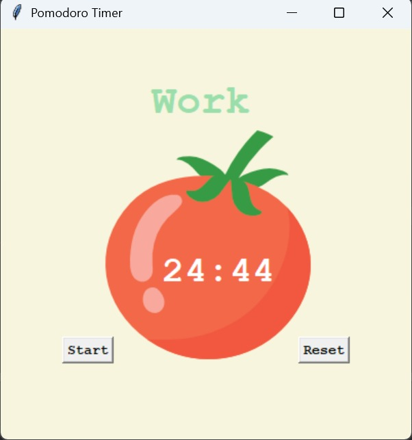

# 🕒 Pomodoro Timer – Tkinter Python App

A desktop application built using **Python** and **Tkinter GUI Library Tcl/Tk** that implements the [Pomodoro Technique](https://en.wikipedia.org/wiki/Pomodoro_Technique) to help boost productivity through structured work and break intervals.

---

## 📌 Features

- ✅ 25-minute work sessions
- 💤 5-minute short breaks
- 🌙 20-minute long break after every 4 work sessions
- 🔄 Reset timer anytime
- ✔️ Checkmark progress tracker

---

## 🖥️ UI Preview



---

## 🚀 How It Works

- When you click **Start**, the timer begins a 25-minute work session.
- After each session, a **5-minute short break** starts automatically.
- After **4 sessions**, you'll get a **20-minute long break**.
- Click **Reset** to cancel the current timer and reset everything to default.

---

## 🧱 Built With

- Python 3
- Tkinter (Python's standard GUI library)
- Math module

---

## 📁 Project Structure

```bash
📂 Pomodoro-Timer/
├── 🖼️ Pomodoro_timer_preview.jpg       # UI preview image used in readme file
├── 📄 main.py                          # Main Python script containing the Tkinter app
├── 📄 readme.md                        # Project documentation
└── 🖼️ tomato.png                       # Image asset used in the canvas (Pomodoro icon)

